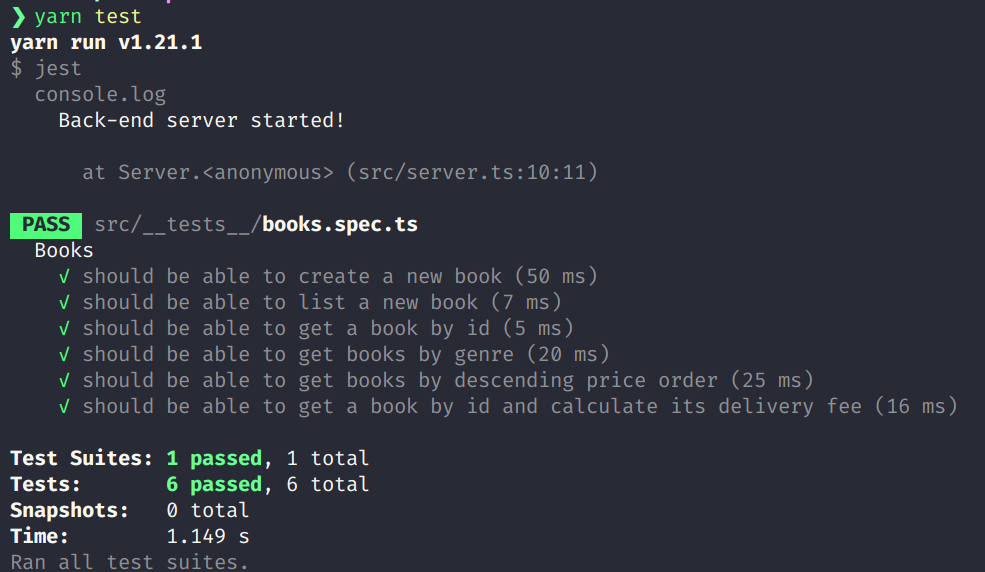
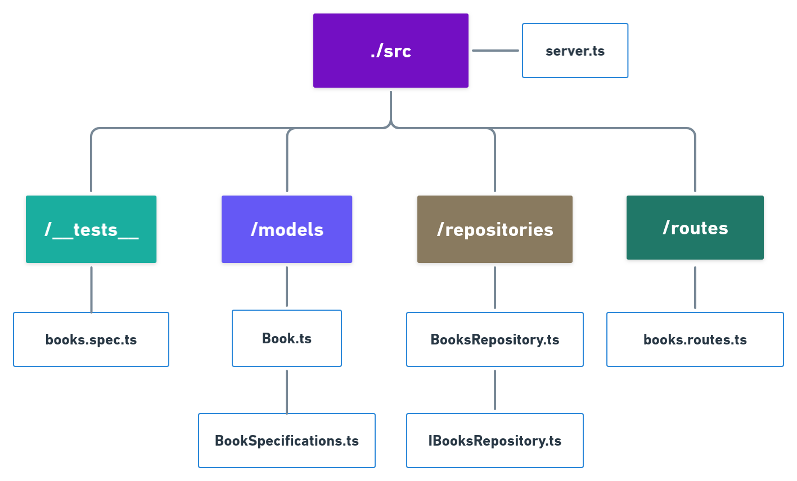

## Descrição

O projeto trata-se de um serviço de API para fornecer dados de um catálogo de livros para um cliente.
É possível buscar livros considerando seus seguintes atributos: nome do livro, ID, nome do autor, preço, ilustrador e gênero.
Também há recurso para listar todos os livros considerando os preços em ordem crescente ou decrescente, assim como calcular seu frete.

## Como executar este projeto

1- Clone o projeto para sua máquina através do comando: `git clone https://github.com/gabrielbarth/BackendTest.git`;  
2- Entre no diretório principal do projeto `cd BackendTest` e instale as dependências `yarn` ou `npm install`;  
3- Execute-o através do comando: `yarn dev:server` ou `npm dev:server`;  
4- Abra algum programa Cliente para realizar requisições a uma API REST, como Insominia, Postman, ou ainda, utilize o navegador;  
5- Realize requisições nas rotas do projeto utilizando o método **http GET** para obter os dados, conforme descrito acima.  

### Recursos disponíveis:

- URN padrão (utilizado em todos recursos): **/books**

Exemplo: http://localhost:5000/ **books**/<recurso>

|  Rota | Tipo da Requisição  | Corpo da requisição  | Descrição  | 
|---|---|---|---|
| **/books**  | GET                | Lista todos os livros do catálogo. | (não possui)       |
| **/books** | POST                | Cria um novo livro. | { "name": "Nome do Livro", "price": 20.00, "specifications": { "Originally published": "Data de publicação",	"Author": "Nome do autor do livro","Page count": 183,	"Illustrator": ["Nome do Ilustrator"],	"Genres": ["Gênero 1",	"Gênero 2"}                         |
| **/books/:id**         | GET               | Lista livro através de seu ID.             | (não possui) |
| **/books/:id/shipping**         | GET               | Lista um livro através de seu ID, com seu valor acrescido pelo frete.             | (não possui) |
| **/books/name**         | POST               | Lista livros por nome.             | {"name": "nome do livro"} |
| **/books/author**         | POST               | Lista livros pelo nome do autor.             | {"author": "nome do autor"} |
| **/books/price**         | POST               | Lista livros pelo preço.             | {"price": 10} |
| **/books/genre**         | POST               | Lista livros por gênero.             | {"genre": "gênero do livro desejado"} |
| **/books/illustrator**         | POST               | Lista livros por ilustradores.             | {"illustrator": "nome do ilustrador do livro"} |
| **/books/price/ascending**         | POST               | Lista livros por ordem crescente de preço.             | (não possui) |
| **/books/price/descending**         | POST               | Lista livros por ordem decrescente de preço.             | (não possui) |

## Como executar os testes do projeto

- Execute-o através do comando: `yarn test` ou `npm test`;

Ao todo foram considerados 6 testes para o projeto, respectivamente:

 - Teste 1: Deve estar apto a criar um novo livro;
 - Teste 2: Deve estar apto a listar um livro cadastrado;
 - Teste 3: Deve estar apto a listar um livro através de seu ID;
 - Teste 4: Deve estar apto a listar livros através de seu gênero;
 - Teste 5: Deve estar apto a listar livros através de ordem decrescente de seus preços;
 - Teste 6: Deve estar apto a listar um livro através considerando o frete (+20%).

## Sobre o pattern e disposição dos diretórios e arquivos

Para o desenvolvimento do projeto foi considerado o Repository Pattern, padrão de projeto que permite manter todas as operações relacionadas ao banco de dados (como criar, ler, atualizar e deletar) em um local separado das regras de negócio da aplicação.

Considerando que a aplicação possui apenas a Entidade Book (livro) e não conta com muitas regras de negócio, não foi considerada a padronização de camadas, como infraestrutura, serviços, entre outros.

A estrutura do projeto trata-se de basicamente três diretórios:
- Model: define a forma como os dados são representados na aplicação;
- Repository: define a camara responsável por realizar as operações de CRUD sobre a gestão dos dados;
- Route: também conhecido como Controller em algumas arquiteturas, é responsável por receber requisições e, executar funções e devolver uma resposta.

A imagem a seguir expõe a estrutura de diretórios do projeto:

## Sobre o desafio

Um cliente tem necessidade de buscar livros em um catálogo. Esse cliente quer ler e buscar esse catálogo de um arquivo JSON, e esse arquivo não pode ser modificado. Então com essa informação, é preciso desenvolver:

- Criar uma API simples para buscar produtos no arquivo JSON disponibilizado.
- Que seja possivel buscar livros por suas especificações(autor, nome do livro ou outro atributo)
- É preciso que o resultado possa ser ordenado pelo preço.(asc e desc)
- Disponibilizar um método que calcule o valor do frete em 20% o valor do livro.

Será avaliado no desafio:

- Organização de código;
- Manutenibilidade;
- Princípios de orientação à objetos;
- Padrões de projeto;
- Teste unitário
- Conhecimento em controle de versão;

Para nos enviar o código, crie um fork desse repositório e quando finalizar, mande um pull-request para nós.

O projeto deve ser desenvolvido em C#, utilizando o .NET Core 2.2 ou superior.

Gostaríamos que fosse evitado a utilização de frameworks, e que tivesse uma explicação do que é necessário para funcionar o projeto e os testes.
